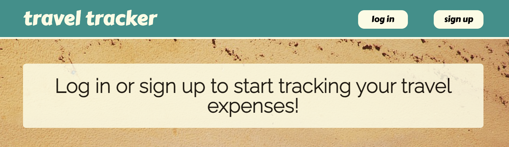
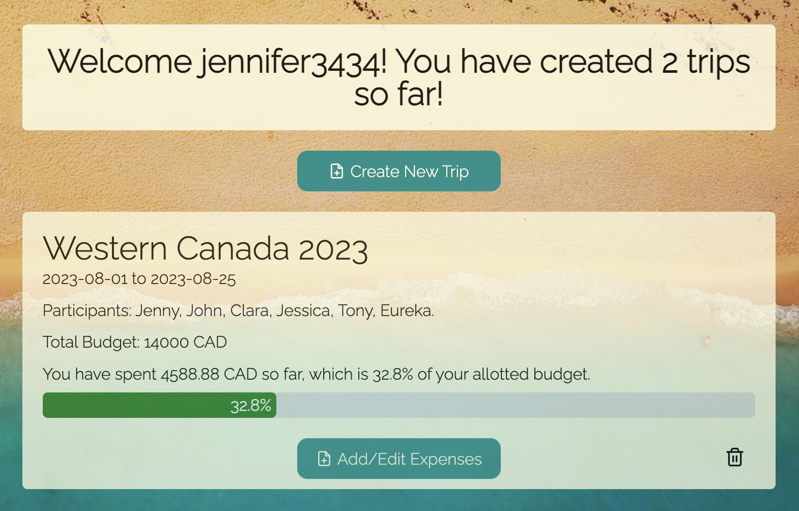
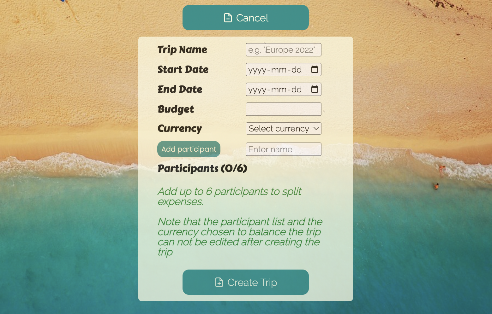
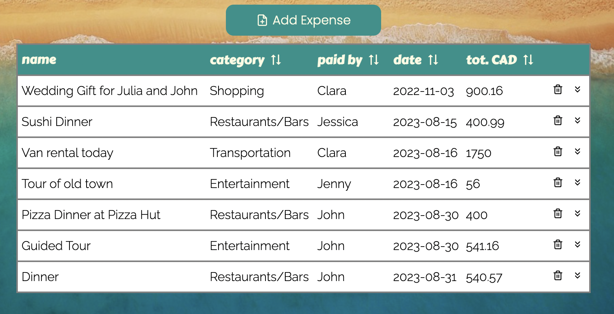
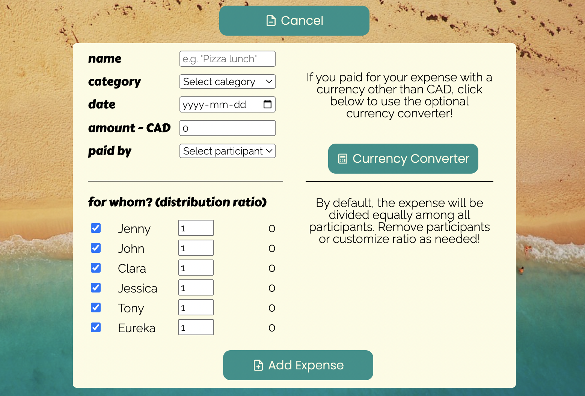
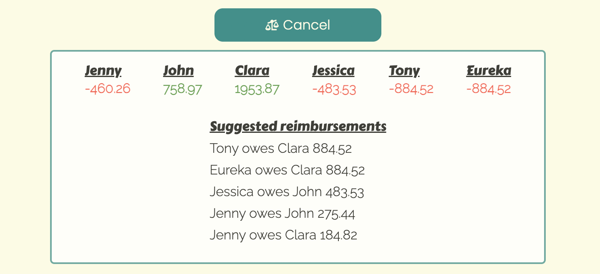

 # Travel Tracker
 
 

    

 

- Live demo available at https://travel-tracker-demo.vercel.app
- Video demo availalbe at https://youtu.be/XHTmO55-3iY 

## General Information
- Travel Tracker is an expense tracker and budgeting tool for travellers with built-in currency conversion and bill-splitting capabilities.
- This was my final project for Concordia University's intensive full-stack web development diploma. 

## Technologies Used
- React
- NodeJS
- ExpressJS
- MongoDb
- Auth0 authentication
- styled-components
- Material UI react tools (MUI)
- Javascript

## Features
- Auth0 user authentication
- Secure API calls using middleware to check JSON web tokens (express-oauth2-jwt-bearer)
- Ability to Create, Read, Update and Delete trips
- For each trip, ability to Create, Read, Update and Delete expenses
- Sortable table for viewing all expenses
- Easily editable fields for trip and expense data - click on data to edit, and click outside to save changes. 
- Currency conversion calculator for foreign currencies, using a free API: https://exchangerate.host/#/#docs 
- Bill splitting capabilities for up to 6 people with customizable distribution ratios. 
- Balances tab, which generates suggested reimbursements to balance out the expenses among all participants.

# Setup

### Frontend

1. Open a terminal in VS Code
2. Type `cd client`
3. Type `yarn install`

Type `yarn start` to start the frontend dev environment.

### Backend

1. Open a second terminal in VS Code
2. Type `cd backend`
3. Type `yarn install`

Type `yarn dev:backend` to start the backend dev environment.

---

## The App 

Landing page with login or signup prompt. 

  

Homepage after login, displaying all trips that the user has created. From this page you can create, update or delete trips. 

Collapsable form for creating a new trip. 

When viewing or editing expenses for an individual trip, you will see a sortable expense table. From this page you can create, update or delete expenses. 

Collapsable form for creating a new expense. Currency calculator is also collapsable. 

Collapsable window for viewing balances and reimbursements. Each participant's final balance (amount paid minus amounts owed) is displayed, and a table of suggested reimbursements is displayed. Participants with a balance owing (a negative value displayed in red) will need to repay the participants with a balance owed (a positive value displayed in green). 

